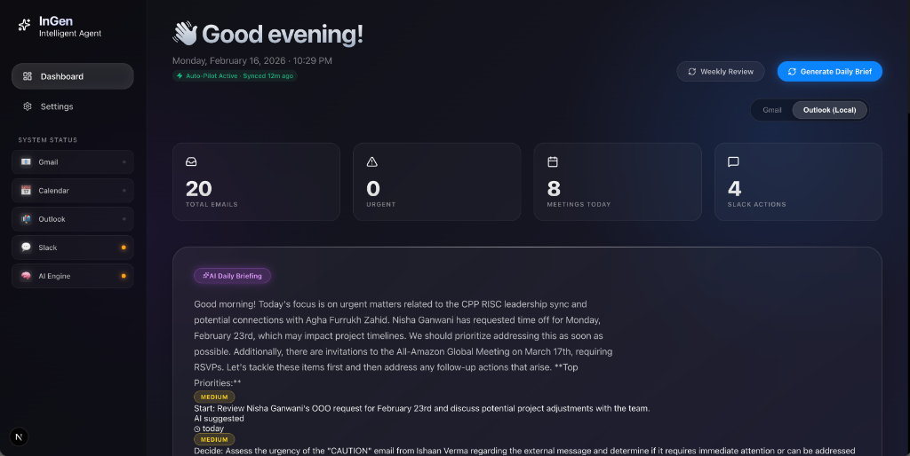
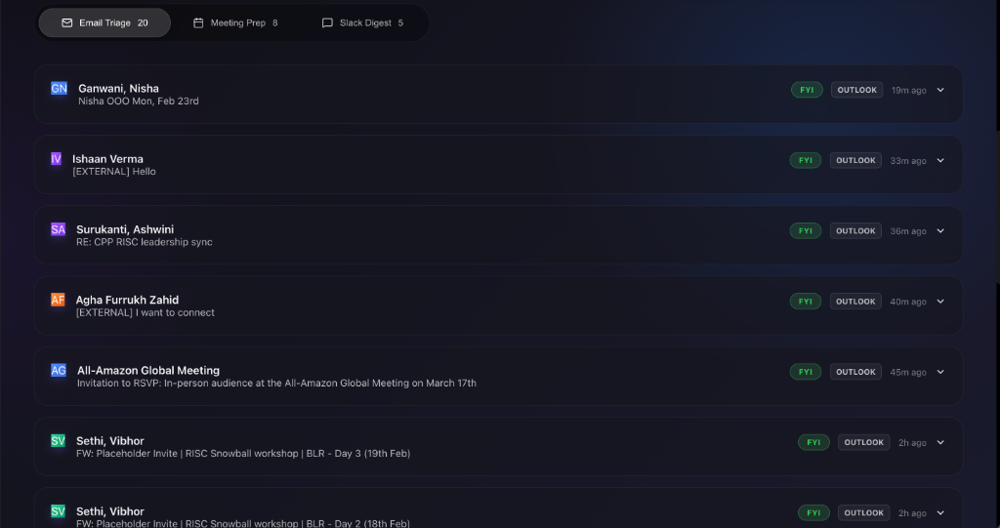
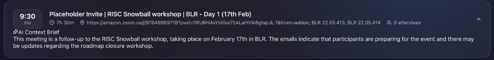

# InGen SmartAI: Local Autonomous Productivity Agent

**InGen SmartAI** is a privacy-first, local-only productivity dashboard that acts as your executive assistant. Unlike cloud-based tools, InGen runs entirely on your machine, accessing your Outlook data via local AppleScript bridges and processing intelligence using local LLMs (Ollama) and Vector Stores.

## The Development Journey
This application was developed incrementally, evolving from a simple dashboard into a context-aware agent.

### Phase 1: Foundation & The "Local-Only" Constraint
We started with a clear goal: **Privacy**. Instead of using the Microsoft Graph API (which requires cloud consent), we built a custom bridge using **AppleScript (JXA)** to talk directly to the local Outlook application.
- **Challenge:** Fetching data locally without blocking the UI.
- **Solution:** Implemented `node-cron` for background ingestion and decoupled the frontend from the data fetching layer.

### Phase 2: Building the Brain (Local RAG)
To make the agent "smart", we needed it to remember past context. We implemented **Retrieval-Augmented Generation (RAG)** entirely locally.
- **Stack:** `hnswlib-node` for the vector database and `ollama` (llama3/gemma) for embeddings.
- **Feature:** We ingested your "Sent Items" to teach the agent your writing style.

### Phase 3: Agentic Workflows
We moved beyond "passive display" to "active assistance".
- **Context-Aware Drafting:** The specific `generateDraft` function was built to search the vector DB for similar past emails and mimic your tone.
- **Meeting Briefs:** We upgraded the meeting view to automatically search for email threads related to the meeting title, generating "Pre-Meeting Briefs" so you're always prepared.

### Phase 4: "InGen" & The Liquid Glass UI
The interface was overhauled to match the sophisticated backend.
- **Design System:** We adopted a "Liquid Glass" aesthetic (Glassmorphism), moving away from standard Material Design to a premium, futuristic look.
- **UX:** Added fluid animations, "skeleton" loading states, and a dedicated "Auto-Pilot" status indicator.

### Phase 5: Optimization & Robustness
As usage grew, we hit performance bottlenecks.
- **The Calendar Bottleneck:** Fetching calendar events was taking 25s+, causing timeouts. We diagnosed this as an inefficient AppleScript loop.
- **The Fix:** We optimized the script to target **Calendar ID 432** directly, reducing fetch time to **<1 second**.
- **Concurrency:** We added file locking to the background agent to prevent multiple sync processes from colliding.

### Phase 6: Context-Aware Intelligence (Vector RAG) & Refactors
**Goal:** Make the AI truly "smart" by giving it memory and context.

1.  **Local Vector Store (`hnswlib-node`)**:
    -   Implemented a local vector database to store email embeddings.
    -   This allows the AI to "remember" past conversations without sending data to the cloud.

2.  **RAG for Meeting Briefs**:
    -   The `prepareMeetingBrief` function now searches the vector store for emails related to the meeting title.
    -   It injects this context into the prompt, allowing the AI to summarize "What happened last?" and identify open questions.

3.  **Enhanced AI Daily Briefing**:
    -   Increased the context window to **2000 characters** per email (utilizing the full power of local LLMs like Llama 3 or Gemma 2).
    -   Refined the prompt to provide a detailed, comprehensive morning greeting and actionable priorities.

4.  **Outlook Optimization & Refactor**:
    -   **Speed:** Replaced the slow "iterate all folders" AppleScript with a direct ID access method, making calendar usage 10x faster.
    -   **Stability:** Refactored `/api/outlook-local` to use a robust JXA service (`fetch_outlook_ui_optimized.js`), eliminating JSON parsing errors caused by the legacy script.

5.  **Smart Dashboard 2.0**:
    -   The dashboard now features a "Liquid Glass" UI with real-time RAG insights.


*Figure 4: The updated dashboard showing the enhanced AI Daily Briefing with detailed context.*


*Figure 5: A meeting card expanded to show the RAG-generated context brief.*


*Figure 6: The optimized Outlook email list with robust fetching.*

---

## Getting Started

First, ensure you have **Ollama** running locally.

Then, run the development server:

```bash
npm run dev
# or
yarn dev
```

Open [http://localhost:3000](http://localhost:3000) with your browser.

## Technical Architecture (InGen SmartAI)

### Overview
We are building a **privacy-first, local-only productivity agent** that acts as your executive assistant. It runs entirely on your Mac, accessing your local Outlook data and providing intelligent insights without sending any data to the cloud.

### 1. The Core Application
-   **Framework:** **Next.js 14+ (App Router)**
    -   *Why:* Unified full-stack framework for reactive UI (React) and backend logic (API Routes).
    -   *How:* `app/page.js` handles the dashboard UI, while `app/api/...` handles data processing and AI calls.

### 2. The Data Bridge (The "Magic")
-   **Integration:** **AppleScript (JXA - JavaScript for Automation)**
    -   *Why:* Traditional APIs (Microsoft Graph) require cloud OAuth and admin consent. JXA allows us to script the local Outlook app directly.
    -   *How:* Node.js spawns `osascript` processes to execute scripts like `fetch_outlook_ui_optimized.js`, returning JSON data from the running Outlook application.

### 3. The Brain (Local Intelligence)
-   **LLM Provider:** **Ollama** (running Llama 3 or Gemma 2)
    -   *Why:* Complete privacy, zero latency, and zero cost. No API keys or data leaks.
    -   *How:* The `services/ai.js` module sends prompts to `http://localhost:11434`.
-   **Memory (RAG):** **HNSWLib-Node** (Vector Store)
    -   *Why:* To give the AI "context" (e.g., "how did I reply to John last week?"). Standard vector DBs (Pinecone) are cloud-based; HNSWLib runs in-memory/file-based locally.
    -   *How:* We convert emails to embeddings (vectors) and store them in a local index file. When you ask a question, we find the most similar vectors and feed them to the LLM.

### 4. Background Workers
-   **Scheduler:** **Node-Cron**
    -   *Why:* To keep data fresh without blocking the UI.
    -   *How:* A background process runs every 15 minutes to fetch *only new* emails (incremental sync) and update the local JSON database.
