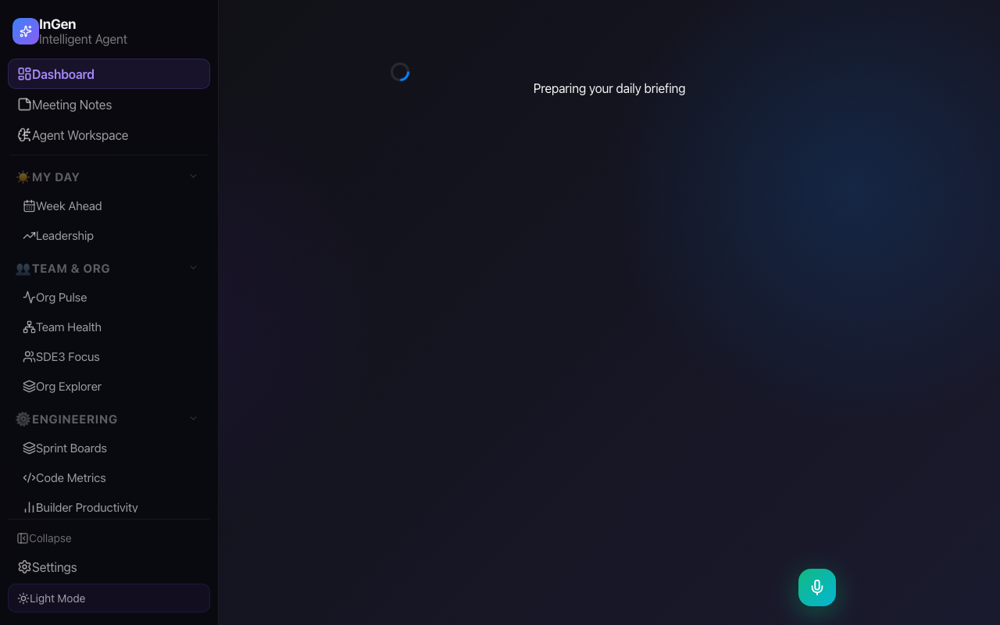
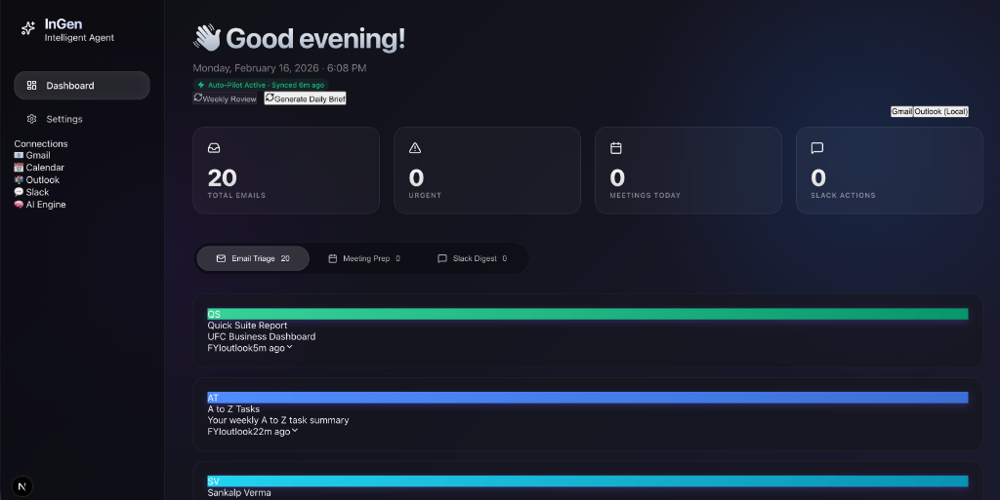
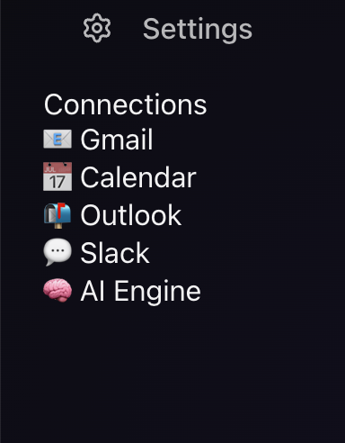

# 🧬 InGen — Local AI Productivity Dashboard

**InGen** is a privacy-first AI productivity dashboard that acts as your executive assistant. Core AI runs locally on your MacBook via Ollama, with optional Amazon Bedrock integration for advanced features. All data stays within Amazon's network — nothing is ever sent to third parties.

> **Local AI + Amazon internal services. Zero third-party data sharing.**

---

## Screenshots

<p align="center">
  
  <br/><em>Dashboard — AI briefing, email triage, meeting prep, and Dive Deep chat</em>
</p>

<p align="center">
  
  <br/><em>Email Triage — Priority swim lanes with AI-powered categorization</em>
</p>

<p align="center">
  
  <br/><em>Meeting Prep — AI-powered meeting preparation with context</em>
</p>

<!-- To capture fresh screenshots of new pages, run the app and take screenshots of:
  /imr              → assets/imr-mission-control.png
  /builder-productivity → assets/builder-productivity.png
  /eng-metrics      → assets/eng-metrics.png
  /ticket-health    → assets/ticket-health.png
  /my-team          → assets/team-health.png
  /week-ahead       → assets/week-ahead.png
-->

---

## Quick Install (macOS)

### Prerequisites

- macOS (Apple Silicon or Intel)
- Microsoft Outlook installed and signed in

### Install from code.amazon.com (Recommended)

Open Terminal and run:

```bash
git clone ssh://git.amazon.com/pkg/InGen-SmartAI ~/InGen
bash ~/InGen/scripts/install-ingen.sh
```

> **Requires:** VPN + Midway auth + SSH key registered on code.amazon.com

### Alternative: Install from tar.gz

1. Download `InGen.tar.gz` (shared via Slack or email)
2. Open Terminal and run:

```bash
mkdir -p ~/InGen-install && cd ~/InGen-install
tar xzf ~/Downloads/InGen.tar.gz
bash */scripts/install-ingen.sh
```

The installer (v2.0) automatically handles everything — **no manual configuration needed**:

**Infrastructure:**

- ✅ Disk space check (15 GB recommended)
- ✅ Xcode Command Line Tools
- ✅ Homebrew (if needed)
- ✅ Node.js 20+ (if needed)
- ✅ Ollama AI engine (if needed)
- ✅ AI models (~10 GB one-time download)
- ✅ MCP tooling (`amzn-mcp`, `builder-mcp` via Amazon Toolbox)

**Configuration (prompted during install):**

- ✅ **Outlook calendar selection** — auto-detects available calendars, lets you pick
- ✅ **Amazon alias** — auto-detects from macOS username, confirms with you
- ✅ **Quip API token** — prompts for your token (get it from https://quip-amazon.com/dev/token)
- ✅ **AWS Bedrock API key** — optional, for Claude Sonnet AI on WBR/Team Health pages
- ✅ **SIM/Taskei goals folder** — paste your Taskei URL to enable Team Health tracking
- ✅ **Org tree fetch** — auto-fetches your team hierarchy from Phonetool

**Post-install:**

- ✅ Desktop shortcut
- ✅ Health verification (native modules, startup checks)
- ✅ **Resume support** — if install fails, re-run and it picks up where it left off

> **All settings are collected interactively during installation.** You can skip any optional setting and configure it later from the Settings page (http://localhost:3000/settings).

### Launch

Double-click **"InGen"** on your Desktop, then open **http://localhost:3000**

---

## First-Time Launch

### Allow macOS Permissions

When InGen starts for the first time, macOS will show a dialog:

> _"Terminal wants to control Microsoft Outlook"_

Click **OK** to allow. This only happens once. InGen uses AppleScript to read your local Outlook data — no internet connection is needed.

> **Note:** The installer already configured your calendar, Amazon alias, Quip token, Bedrock key, and SIM goals folder during installation. If you need to change any of these later, go to **http://localhost:3000/settings**.

---

## What's New 🆕

### 🔊 Morning Briefing — Your Personal Jarvis

Open the dashboard, tap one button, and InGen delivers a **cinematic spoken briefing** of your entire day — pulling data from all five sources simultaneously:

> _"Good morning. You've got 15 emails — 3 need immediate attention from Alice and Bob. Six meetings today, starting with CPP Sync at 9. Your goals look solid: 8 green, 2 yellow, 1 red. That ticket from last week is 16 days old — it's developing opinions. Your team pushed 23 code reviews, though 3 are going stale. That's your day. Go make it count."_

**How it works:**

1. Click **🔊 Morning Briefing** on the dashboard
2. A cinematic full-screen overlay appears with a glowing orb animation
3. Data cards fly in showing real-time stats from emails, calendar, goals, code metrics, and tickets
4. **Bedrock Claude Sonnet** synthesizes everything into a natural, Jarvis-style spoken narrative
5. Text appears word-by-word in a teleprompter style with purple glow highlighting
6. High-quality **Text-to-Speech** reads the briefing aloud (Zoe Premium voice)
7. Cards pulse and highlight as InGen mentions each data source

**Features:** Mute toggle, replay, auto-scroll, ascending/descending chime bookends, 30-minute cache, Ollama fallback if Bedrock isn't configured.

### 🎙️ Voice Assistant — Talk to InGen

Press **V** anywhere in InGen (or click the floating mic button) to ask questions with your voice:

- _"What are my red goals?"_
- _"How many tickets are open?"_
- _"Summarize my emails from Alice"_

InGen listens via speech recognition, sends your question to the AI chat (with full RAG context), and **speaks the answer back** with a natural voice. Responses are rewritten by Bedrock into conversational spoken English before TTS playback.

**Features:** Real-time mic waveform visualization, conversation history (multi-turn), page-aware context, keyboard shortcut (V), interruption support (start talking to stop InGen speaking).

---

## Features

### 📊 AI Daily Briefing

AI-generated executive summary of your day — top priorities, urgent emails, key meetings, and linked Quip documents. Streams word-by-word (ChatGPT-style) on first generation, then cached for instant loads. Dashboard shows today's email count, urgent count, and meeting count.

### 📧 Email Triage

Emails organized into priority swim lanes: 🔴 Respond Now, 🟡 Respond Today, 🟢 FYI. Filter by date range (Today, 7/14/30 days) with pagination.

### 📅 Week Ahead

7-day calendar view with meeting load indicators, deep work slots, 1:1 detection, and AI coaching brief.

### 💬 Dive Deep Chat

ChatGPT-style AI chat that searches your email and calendar data (RAG). Ask questions like "What did I discuss with Surbhi last week?" with cited sources.

### 📝 Smart Draft Replies

AI-generated email drafts that mimic your writing style using past sent emails (RAG). References Quip documents when linked.

### 📊 Leadership Analytics

Time audit, relationship health scores, action item extraction, blocker detection, and decision tracking.

### 🔔 Proactive Insights

AI-generated meeting prep insights, email priority alerts, and weekly reports delivered as toast notifications.

### 🏥 Team Health (WBR Goals)

Weekly Business Review dashboard showing goal status across your org. Features:

- **Dynamic WBR title** — Shows "Classification and Policy Platform - 2026 Goals and Projects Status" with current week and date range
- **AI Goal Health Summary** — Bedrock-powered (Claude Sonnet) executive summary with Ollama fallback; goal classification (On Track, Needs Attention, Completed, Stale)
- **Status color cards** — Green/Yellow/Red/Total at a glance
- **ECD tracking** — Missed ECDs, upcoming ECDs (3-day warning), ECD drift detection with slipped/pulled-in comparison
- **Deep scan** — On-demand recursive scan (depth-3) for missed ECDs in child/grandchild tasks
- **Goal sections** — Goals organized by workflow status (Started, Blocked, In Planning, etc.)
- **Child task expansion** — Drill down into subtasks with recursive expand
- **Stale announcement detection** — Announcements older than threshold (default 6 days) highlighted amber with ⚠️
- **Smart goal discovery** — TaskeiListTasks with pagination + gap-fill (replaces prefix enumeration), sequential fetch with throttle handling and retry

**Data flow:** Taskei (SIM) via `builder-mcp` (`TaskeiListTasks` + `TaskeiGetTask`) → `wbr-report.js` (goal parsing + ECD snapshots) → React dashboard

### 📊 Engineering Metrics (Code Metrics)

Per-engineer code review dashboard powered by `code.amazon.com` via `builder-mcp`. Features:

- **Org-level summary** — Total CRs created/reviewed, P50 turnaround, stale CRs
- **Engineer table** — Sortable by CRs Created, CRs Reviewed, Review Ratio (click headers to sort)
- **Week-over-week trends** — ▲/▼ delta indicators per engineer vs last week
- **3-week declining streak** — Amber row highlighting for engineers with 3 consecutive weeks of declining output
- **Mini sparklines** — 8-week CR creation trend per engineer
- **Weekly velocity chart** — Horizontal bar chart showing CR created vs reviewed over 8 weeks
- **Year-to-date trend** — Full year line chart with 4-week rolling average
- **Stale CR alerts** — Org-wide count of CRs open >5 days
- **Engineer drill-down** — Slide-out panel with 12-week history and recent CRs
- **CR detail enrichment** — Full titles, descriptions, and human comments fetched from code.amazon.com (bot comments filtered out)
- **Heatmap visualization** — Larger cells, wider engineer names, bigger sparklines with smart tooltip positioning
- **Backfill** — One-click backfill for historical weekly data (52-week retention) with CR enrichment pass

**Data flow:** Org roster (Phonetool → `org-store.js`) → per-engineer code search (`builder-mcp` → `ReadInternalWebsites`) → CR enrichment (titles + comments) → SQLite weekly snapshots (`data/eng-metrics.db`) → React dashboard

### 🎫 Ticket Health

Resolver group ticket dashboard showing open/aging/SLA status across your teams. Features:

- **Summary cards** — Total open, assigned to you, aging >14d, aging >30d, resolved (30d), baseline overdue
- **Status distribution** — Visual bar showing ticket status breakdown
- **Resolver group table** — Role, open count, resolved, status breakdown, oldest ticket age, baseline status
- **Aging tickets tab** — Tickets older than 7 days sorted by age
- **My tickets tab** — Tickets assigned to you across all resolver groups
- **Group detail panel** — Slide-out showing all tickets for a specific resolver group
- **Send to Slack** — One-click ticket health summary to any Slack channel. Enter a channel name (defaults to `cpp-stores-automation-sdm`), click Send, and a formatted summary with emoji, counts, and per-group breakdown is posted via `slack-mcp`

**Data flow:** `builder-mcp` → `TicketingReadActions` → `ticket-health.js` (caching) → React dashboard; Slack send: `slack-mcp` → channel name resolution (direct / search / list) → `post_message`

### 💰 IMR Mission Control

Cerberus/CloudTune financial telemetry dashboard for infrastructure cost tracking. Features:

- **Cerberus SSE streaming** — Real-time data hydration with live telemetry log showing each data source as it loads
- **4 summary cards** — Actuals MTD, Budget (CPT++), Estimated Spend (actuals), Estimated Spend (scenario) — with MoM, YoY, and variance indicators
- **Budget pacing gauge** — Projected spend vs budget with status labels (On Track, At Risk, Over Budget, Under Budget)
- **8 tab views** — AWS Infra by Fleet, AWS Summary, Planned Products, Other Products, Data Transfer, All Infra (AWS+SDO), SDO Services, IMR Goal by Fleet
- **Fleet drill-down** — Click any fleet row to drill into child fleets
- **InGen Cost Analysis** — AI-powered heuristic insights grouped by severity (⚠️ Warnings, ✅ Positive, ℹ️ Observations) covering budget health, MoM/YoY trends, product anomalies, fleet over-budget alerts, concentration risk, and actionable recommendations
- **LLM executive narrative** — Bedrock-generated 2-3 paragraph cost briefing
- **Share to Slack** — One-click Slack sharing with rich formatted message including summary, fleet breakdown, cost analysis, and executive narrative with billing month

**Data flow:** Cerberus/CloudTune API (via Midway auth) → `cloudtune.js` (24h caching) → `imr-telemetry.js` (SSE streaming + AI analysis) → React dashboard

### 📊 Builder Productivity

Nightingale/Builder Insights metrics dashboard showing org-wide engineering productivity. Features:

- **4 metric categories** — 🚀 Delivery Velocity, 🛡️ Quality & Reliability, 📊 Scale & Capacity, 🎓 Builder Onboarding
- **Progressive streaming** — Categories load in parallel via SSE with skeleton placeholders
- **Trend charts** — Smooth cubic bezier sparklines with gradient fills per metric
- **AI insights** — Per-category InGen-generated insights with specific observations and recommendations
- **Direct Reports heat map** — Manager comparison table with per-metric heatmap coloring, inline sparklines, and best/worst highlighting
- **Share to Slack** — Rich Slack message with all metrics, trends, AI insights, and manager comparison table with 🟢/🔴 best/worst indicators
- **Configurable periods** — Monthly, Weekly, or Quarterly views with 3/6/12 month range selection
- **View As** — Impersonate any alias to view their org's metrics

**Data flow:** Builder Insights API (Nightingale) via `software-builder-insights-prod-mcp` → `builder-productivity.js` (metric orchestration) → SSE streaming → React dashboard

### 💬 Slack Integration

Share reports to Slack channels or DMs from multiple pages:

- **IMR Mission Control** — Fleet cost summary, fleet breakdown, InGen Cost Analysis, executive narrative
- **Builder Productivity** — All 4 metric categories with trends, AI insights, manager comparison table
- **Ticket Health** — Ticket summary, resolver group breakdown, aging alerts
- **Channel + DM support** — Type `#channel-name` or `@user` to send to channels or direct messages
- **Smart channel resolution** — Tries direct post → search-based resolution → channel list fallback
- **Status indicators** — Real-time sending/sent/failed states with error messages

### 🧠 Adaptive Learning

InGen learns from your behavior to improve over time. Visible feedback hooks across the UI:

- **Email category override** — Click any priority badge (Respond Now / Respond Today / FYI) to re-categorize. Shows 🏷️ after correction. InGen learns sender patterns.
- **Draft reply feedback** — 👍/👎 on every AI-generated draft reply
- **Q&A answer feedback** — 👍/👎 on "Ask a question about this email" answers
- **Chat feedback** — 👍/👎 on every Dive Deep assistant message
- **Passive signals** — Email click tracking, page view tracking, search session tracking

**Pipeline:** UX → `/api/feedback` → `feedback-store.js` (SQLite) → `adaptive-engine.js` (nightly) → improved AI responses

### 📨 Email Thread View

Expanding an email loads the full conversation thread from Exchange:

- Individual message bubbles with sender avatars, timestamps, expand/collapse
- Thread summary with message count
- Full HTML rendering in sandboxed iframe (dark-mode enforced)
- Graceful fallback to cached body when thread loading fails

### 🤖 Slack Agent

Background agent monitors your Slack DMs and responds automatically:

- Polls DMs via `slack-mcp` every 60 seconds
- Detects new messages since last watermark
- Uses full InGen AI (RAG + tools) to generate contextual replies
- Posts responses as threaded replies
- Indexes Slack channel content into vector store for RAG search

### 📝 Notes

Personal notes page for quick capture and reference:

- Create, edit, delete notes
- Rich text support
- Persistent storage via SQLite

### 🌗 Dark/Light Theme

Toggle between dark and light mode from the sidebar or Settings page. Preference persists in localStorage with anti-flash script for instant theme application on page load.

### 📐 Collapsible Sidebar

Sidebar collapses to icon-only mode (72px) for more content space. State persists in localStorage. Expand/collapse via button at bottom of sidebar.

---

## Architecture

```
Outlook (local) → AppleScript → Local Data Store (JSON)
                                        ↓
                                  Vector Store (HNSWLib)
                                        ↓
                                    AI Engine (Ollama qwen3)
                                        ↓
                                  Dashboard (Next.js React)
```

Core AI (Ollama) and data storage run locally on your machine. Amazon Bedrock, MCP tools (Phonetool, code.amazon.com, Taskei, Quip, Slack), and Outlook MCP access Amazon internal services — all data stays within Amazon's network.

| Component       | Technology                                                                                                                       |
| --------------- | -------------------------------------------------------------------------------------------------------------------------------- |
| Frontend        | Next.js 16, React 19, Liquid Glass UI                                                                                            |
| AI/LLM          | Ollama (qwen3:latest, 8.2B params); optional Amazon Bedrock (Claude Sonnet) for WBR summaries, Morning Briefing + key page chats |
| Voice TTS       | Web Speech API (`SpeechSynthesis`) with smart voice selection (Zoe Premium → Siri → Samantha Enhanced)                           |
| Voice STT       | Web Speech API (`SpeechRecognition`) for voice-to-text in Voice Assistant                                                        |
| Voice Rewrite   | Bedrock Claude Sonnet rewrites AI responses into natural spoken English before TTS                                               |
| Embeddings      | qwen3-embedding (4096 dimensions)                                                                                                |
| Vector DB       | hnswlib-node (local, in-process)                                                                                                 |
| Data Bridge     | AppleScript/JXA → local JSON cache                                                                                               |
| Background      | node-cron (hourly sync)                                                                                                          |
| MCP Integration | `builder-mcp` for Phonetool, code.amazon.com, Taskei, Quip; `slack-mcp` for Slack messaging                                      |
| Data Storage    | JSON files + SQLite (eng-metrics, issues, org-store, insights)                                                                   |

---

## Testing

> **76 test suites · 605 tests · 0 failures · 100% suite pass rate**

InGen maintains comprehensive automated test coverage across all services and API routes.

| Category   | Suites | Tests   | What's Covered                                                                   |
| ---------- | ------ | ------- | -------------------------------------------------------------------------------- |
| Services   | 39     | ~400    | All 39 service modules — AI, vector store, Outlook, Slack, MCP, scheduling, etc. |
| API Routes | 37     | ~200    | All 37 API route handlers — export validation, success paths, error handling     |
| **Total**  | **76** | **605** | **Every service and API route in the codebase**                                  |

### Running Tests

```bash
npm test                    # Run all tests
npm run test:services       # Service tests only
npm run test:api            # API route tests only
npm run test:coverage       # Full run with coverage report
npm run test:generate       # Auto-generate test stubs for new modules
```

### Test Infrastructure

- **Framework:** Jest 29 with Babel transpilation for ESM/CJS interop
- **Mocking strategy:** All external dependencies (Ollama, Outlook, Slack, SQLite, MCP, next-auth) are mocked at the module boundary — tests run in <4 seconds with zero network or disk I/O
- **Auto-generation:** `scripts/generate-tests.js` introspects source files to scaffold test stubs for new services, API routes, and components, ensuring coverage keeps pace with development
- **CI-ready:** `npm test` exits with code 0 only when all 605 tests pass

---

## Architecture, Design & Coding Best Practices

### Architecture Patterns

| Pattern                          | Implementation                                                                                                                                |
| -------------------------------- | --------------------------------------------------------------------------------------------------------------------------------------------- |
| **Amazon-internal privacy**      | Core AI (Ollama) runs on-device; Bedrock + MCP tools access Amazon internal services only — zero third-party data sharing                     |
| **Service-oriented backend**     | 39 discrete service modules (`services/`) with single responsibility — each owns one domain (AI, email, calendar, Slack, vector search, etc.) |
| **Thin API orchestration layer** | 37+ Next.js App Router API routes (`app/api/`) act as lightweight wrappers that compose services — no business logic in routes                |
| **Background agent pattern**     | `node-cron` scheduled sync with platform-specific implementations (`background-agent.js` for Mac, `background-agent-windows.js` for Windows)  |
| **MCP integration layer**        | Model Context Protocol client (`mcp-client.js`) for external tool access (Taskei, code.amazon.com, Slack) via `builder-mcp` and `slack-mcp`   |
| **Multi-tier storage**           | JSON file cache (fast reads) → SQLite (structured queries for eng-metrics, issues, insights) → HNSWLib (vector similarity search)             |

### Design Patterns

| Pattern                    | Where & Why                                                                                                                                                  |
| -------------------------- | ------------------------------------------------------------------------------------------------------------------------------------------------------------ |
| **Singleton instances**    | `VectorStore`, `InsightStore`, `OllamaClient` — stateful services exported as class instances to manage index/DB connections across requests                 |
| **Strategy pattern**       | `platform-detector.js` routes to `outlook-local.js` (Mac/AppleScript) or `outlook-windows.js` (Windows/PowerShell) at runtime                                |
| **Tool registry**          | `tool-registry.js` — central registry for 20+ agent tools with name, description, icon, parameters, and `execute()` function; enables dynamic tool discovery |
| **Hot-reloadable config**  | `prompt-loader.js` watches `config/prompts.json` with cache invalidation; `settings.json` for runtime config — no restart needed                             |
| **Graceful degradation**   | Ollama (local) as primary LLM with Amazon Bedrock (cloud) as optional upgrade; mock data fallback for development                                            |
| **Stale-while-revalidate** | `local-store.js` serves cached data immediately, refreshes in the background — the UI never blocks on sync                                                   |

### Performance Optimizations

#### Battery & CPU

| Optimization                 | Detail                                                                                                        |
| ---------------------------- | ------------------------------------------------------------------------------------------------------------- |
| **60-minute sync interval**  | Outlook data sync reduced from 15-min to 60-min cron — 4× fewer AppleScript IPC calls                         |
| **Weekday-only AI insights** | Insight generation runs only at 9 AM + 1 PM on weekdays (was every 30 min) — saves ~90% of LLM invocations    |
| **Deferred startup work**    | Insight generation, Slack sync, and vector store sync are NOT run on startup — wait for their scheduled time  |
| **Staggered cron offsets**   | Email sync at `:00`, Slack sync at `:15` — prevents thundering herd on CPU and network                        |
| **Ollama model auto-unload** | `keep_alive: '2m'` — LLM model unloads from VRAM/RAM after 2 minutes of idle, freeing ~5 GB                   |
| **5-minute sync timeout**    | Background sync processes are killed after 5 minutes to prevent hung AppleScript processes from consuming CPU |

#### Memory & I/O

| Optimization                   | Detail                                                                                                                                    |
| ------------------------------ | ----------------------------------------------------------------------------------------------------------------------------------------- |
| **In-memory caching with TTL** | Calendar data (5-min TTL), ticket health (5-min TTL) — eliminates redundant AppleScript/MCP calls                                         |
| **Double-checked locking**     | Calendar cache uses a mutex with pre-lock + post-lock cache verification — prevents duplicate expensive fetches under concurrent requests |
| **Outlook access mutex**       | Global mutex serializes AppleScript calls — Outlook's single-threaded IPC channel cannot handle concurrency                               |
| **Lazy-loaded vector store**   | `VectorStore` loaded via dynamic `import()` only when RAG search is needed — saves ~50 MB on pages that don't use it                      |
| **Incremental sync**           | Background agent uses `fetch_outlook_incremental.js` for delta-only email sync instead of full re-fetch                                   |
| **Batch concurrency control**  | Quip document fetching with configurable `maxConcurrent` limit to avoid overwhelming the MCP server                                       |
| **Retry with backoff**         | Rate-limited LLM API calls wrapped with exponential retry logic                                                                           |

### Coding Best Practices

| Practice                            | Implementation                                                                                                                               |
| ----------------------------------- | -------------------------------------------------------------------------------------------------------------------------------------------- |
| **Structured logging**              | Centralized `logger.js` with child loggers per module, 4 log levels (DEBUG/INFO/WARN/ERROR), file + console output with timestamps           |
| **ESM/CJS interop**                 | `createRequire(import.meta.url)` bridge pattern for cleanly mixing ESM imports with CommonJS `require()` in Next.js App Router               |
| **Comprehensive test coverage**     | 76 test suites, 605 tests — every service and API route tested with proper dependency mocking                                                |
| **Configuration as code**           | `config/settings.json` (runtime) + `config/prompts.json` (AI prompts) externalized and hot-reloadable — no hardcoded values                  |
| **Error boundaries**                | Every API route wrapped in try/catch with structured JSON error responses and appropriate HTTP status codes                                  |
| **Module path aliasing**            | `@/` prefix maps to project root via `jsconfig.json` — clean imports across the codebase                                                     |
| **Separation of concerns**          | Services own business logic, API routes own HTTP concerns, components own UI — no cross-layer leakage                                        |
| **Auto-generated test scaffolding** | `scripts/generate-tests.js` introspects `module.exports` and `export function` declarations to auto-create test stubs with appropriate mocks |

---

## Pages

| Route                   | Page                 | Description                                                                 |
| ----------------------- | -------------------- | --------------------------------------------------------------------------- |
| `/`                     | Dashboard            | AI briefing, email triage (priority swim lanes), meeting prep, AI chat      |
| `/week-ahead`           | Week Ahead           | 7-day calendar with AI coaching                                             |
| `/meeting-prep`         | Meeting Prep         | AI-powered meeting preparation with context                                 |
| `/leadership`           | Leadership           | Time audit, relationships, action items, blockers                           |
| `/my-team`              | Team Health          | WBR goal status with AI summary                                             |
| `/eng-metrics`          | Code Metrics         | Per-engineer CR dashboard with heatmaps                                     |
| `/ticket-health`        | Ticket Health        | Resolver group ticket dashboard with Slack integration                      |
| `/imr`                  | IMR Mission Control  | Cerberus/CloudTune fleet cost tracking with InGen Cost Analysis + Slack     |
| `/builder-productivity` | Builder Productivity | Nightingale org metrics with manager comparison + Slack                     |
| `/cpp-wbr`              | CPP WBR              | CPP-specific Weekly Business Review preparation                             |
| `/org-pulse`            | Org Pulse            | Organization health and sentiment tracking                                  |
| `/org-explorer`         | Org Explorer         | Interactive org tree visualization                                          |
| `/team-pulse`           | Team Pulse           | Team activity and engagement metrics                                        |
| `/sprints`              | Sprints              | Sprint tracking and velocity                                                |
| `/notes`                | Notes                | Personal notes with create/edit/delete                                      |
| `/agent`                | Agent Workspace      | AI agent task execution with tool registry                                  |
| `/wbr-prep`             | WBR Prep             | Weekly Business Review preparation document                                 |
| `/sde3-focus`           | SDE3 Focus           | Senior engineer development tracking                                        |
| `/insights/analytics`   | Insights             | Proactive AI insight analytics                                              |
| `/settings`             | Settings             | Calendar, alias, Quip, WBR config, org sync, AI temperature, Bedrock, theme |

---

## Manage InGen

### Update to Latest Version

```bash
~/InGen/scripts/update-ingen.sh
```

### Uninstall

```bash
~/InGen/scripts/uninstall-ingen.sh
```

The updater (v2.0):

- Pulls latest code, rebuilds native modules
- Updates MCP tooling (`amzn-mcp`, `builder-mcp`) via Toolbox
- Clears Next.js cache and stale databases

The uninstaller (v2.0):

- Prompts before deleting anything
- Removes `~/InGen/`, Desktop shortcut, and install progress file
- Does NOT remove Node.js, Ollama, AI models, MCP tools, or Quip token
- Tells you how to reclaim disk space (~10 GB for models)

### Rebuild Distribution Package (for developers)

```bash
bash scripts/package-ingen.sh
```

Creates `~/Desktop/InGen.tar.gz` (< 3 MB) ready to share via Slack. The packager (v2.0) auto-cleans `settings.json` of user-specific values before archiving, then restores your local settings.

---

## Troubleshooting

### App won't start

- Ensure Ollama is running: `ollama serve`
- Check Node.js version: `node -v` (needs 20+)
- Check logs: `cat ~/InGen/smartai.log`

### Calendar shows 0 events

- Verify calendar ID in Settings (http://localhost:3000/settings) or `config/settings.json`
- Ensure Outlook is open and signed in (Classic Outlook required — New Outlook does not support AppleScript)
- Re-run the installer to re-select your calendar: `bash ~/InGen/scripts/install-ingen.sh`

### AI briefing takes too long

- First briefing after restart takes 30-60 seconds (Ollama model loading)
- Subsequent briefings are cached for 30 minutes
- Check if Ollama is running: `curl http://127.0.0.1:11434/api/tags`

### Quip documents not loading

- Verify your token: `cat ~/.amazon-internal-mcp-server/.env`
- Ensure `amzn-mcp` is installed: `which amzn-mcp` or `~/.toolbox/bin/amzn-mcp --version`
- Disable Quip in Settings if you don't need it

### High battery/CPU usage

- InGen syncs from Outlook every 60 minutes (battery-optimized)
- Ollama model unloads after 2 minutes of idle
- For maximum battery savings, stop InGen when not in use

---

## Privacy & Security

- **Local AI** — Core LLM (Ollama qwen3) runs entirely on your MacBook — embeddings, vector search, and most AI processing happen locally
- **Amazon Bedrock** — When configured, Morning Briefing, WBR summaries, and key page chats use Claude Sonnet via your corporate AWS credentials. Data stays within Amazon's Bedrock infrastructure.
- **Amazon MCP tools** — Phonetool, code.amazon.com, Taskei, Quip, Slack, and Outlook access is via Amazon internal MCP servers. Data flows only within Amazon's network.
- **Zero third-party sharing** — No data is ever sent outside Amazon. No external APIs, no third-party LLMs, no cloud analytics.
- **No accounts** — No sign-ups, no subscriptions
- **No telemetry** — Zero tracking or external analytics
- **Your data stays yours** — Local cache stored in `~/InGen/data/`. Cached emails, calendar, and AI responses are on your machine only.

---

## 🤝 Contributing

InGen is actively developed and we welcome contributions from across the org! Whether you're an SDM wanting a new dashboard view, an SDE wanting to improve the AI, or a PM wanting better meeting prep — there's something for everyone.

### Getting Started

```bash
# Clone the repo
git clone ssh://git.amazon.com/pkg/InGen-SmartAI ~/InGen-dev
cd ~/InGen-dev

# Install dependencies
npm install

# Run in development mode (hot reload)
npm run dev

# Open http://localhost:3000
```

### How to Contribute

#### 1. Create a Share Branch

InGen uses GitFarm share branches for collaboration:

```bash
# Create your feature branch
git push amazon HEAD:refs/namespaces/share/refs/namespaces/YOUR_ALIAS/refs/heads/FEATURE_NAME
```

Your branch will appear at: `https://code.amazon.com/packages/InGen-SmartAI/logs/share/YOUR_ALIAS/FEATURE_NAME`

#### 2. Follow the Kiro Steering Files

InGen uses [Kiro](https://kiro.dev) steering files (`.kiro/steering/`) to guide all development. Before writing code, familiarize yourself with:

| File                             | What It Covers                                         |
| -------------------------------- | ------------------------------------------------------ |
| `ingen-smartai-architecture.md`  | Project structure, data flow, module responsibilities  |
| `ingen-smartai-anti-patterns.md` | What NOT to do — common mistakes and how to avoid them |
| `react-best-practices.md`        | 40+ React/Next.js performance rules                    |
| `testing-best-practices.md`      | Testing philosophy: minimal mocking, behavioral tests  |
| `email-data-flow.md`             | Email cache format, MCP data sources, content caps     |
| `composition-patterns.md`        | DRY patterns, component extraction guidelines          |

If you use Kiro as your IDE, these files are automatically loaded as context for AI assistants — ensuring AI-generated code follows project conventions.

#### 3. Code Quality Standards

InGen enforces formatting automatically via **Prettier + Husky pre-commit hooks**:

- **Prettier** runs on every commit (`.prettierrc` config)
- **ESLint** for code quality (`eslint.config.mjs`)
- **No empty catch blocks** — at minimum log a warning
- **No inline styles** when the pattern repeats 15+ times — extract to CSS classes
- **Component files < 400 lines** — extract sub-components
- **Services own business logic**, routes own HTTP concerns, components own UI

#### 4. Run Tests Before Submitting

```bash
npm test                    # All 605 tests must pass
npm run test:coverage       # Check coverage report
```

### Areas Where You Can Help

| Area                     | Difficulty | Description                                                                   |
| ------------------------ | ---------- | ----------------------------------------------------------------------------- |
| 🐛 Bug fixes             | Easy       | Fix UI issues, edge cases, error handling                                     |
| 📊 New dashboard views   | Medium     | Add pages for oncall rotation, sprint tracking, team pulse                    |
| 🤖 AI improvements       | Medium     | Better prompt engineering, model selection, RAG quality                       |
| 🔌 New MCP integrations  | Medium     | Connect to Quip, Sage, JIRA, or other internal tools                          |
| 🧪 Test coverage         | Medium     | Add behavioral tests following `.kiro/steering/testing-best-practices.md`     |
| ♿ Accessibility         | Medium     | Add ARIA labels, keyboard navigation, screen reader support                   |
| 📱 Mobile responsiveness | Medium     | Optimize dashboard for tablet/mobile views                                    |
| 🏗️ Architecture          | Hard       | Migrate routes to `withRouteHandler`, adopt `readSettingsSafe`, unified cache |
| 🪟 Windows support       | Hard       | Improve PowerShell-based Outlook integration for Windows                      |

### Project Structure

```
├── app/                    # Next.js App Router (pages + API routes)
│   ├── page.js            # Dashboard (email triage, meetings, AI chat)
│   ├── api/               # 37+ API route handlers
│   └── [feature]/page.js  # Feature pages (eng-metrics, ticket-health, etc.)
├── components/             # React components (EmailCard, MeetingCard, AIChat, etc.)
├── services/               # 45+ backend service modules (AI, email, calendar, Slack, etc.)
├── config/                 # Runtime config (settings.json, prompts.json)
├── data/                   # Local data cache (emails.json, SQLite databases)
├── brain/                  # Vector store (HNSWLib index + SQLite vectors)
├── scripts/                # Install, update, sync, and utility scripts
├── .kiro/steering/         # AI development guidelines
└── __tests__/              # Jest test suites + MCP fixtures
```

### Contact

- **Slack:** #ingen-smartai (or DM @sankalpv)
- **Code Browser:** https://code.amazon.com/packages/InGen-SmartAI
- **Owner:** Sankalp Verma (sankalpv@)

---

## License

Internal Amazon tool — See company policies for usage guidelines.
