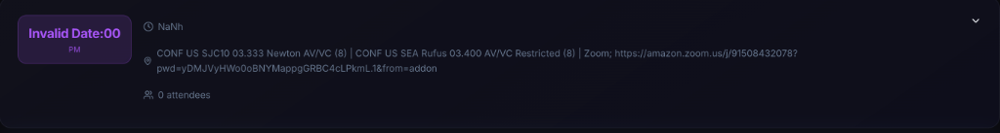

# InGen SmartAI: Local Autonomous Productivity Agent

**InGen SmartAI** is a privacy-first, local-only productivity dashboard that acts as your executive assistant. Unlike cloud-based tools, InGen runs entirely on your machine, accessing your Outlook data via local AppleScript bridges and processing intelligence using local LLMs (Ollama) and Vector Stores.

## The Development Journey
This application was developed incrementally, evolving from a simple dashboard into a context-aware agent.

### Phase 1: Foundation & The "Local-Only" Constraint
We started with a clear goal: **Privacy**. Instead of using the Microsoft Graph API (which requires cloud consent), we built a custom bridge using **AppleScript (JXA)** to talk directly to the local Outlook application.
- **Challenge:** Fetching data locally without blocking the UI.
- **Solution:** Implemented `node-cron` for background ingestion and decoupled the frontend from the data fetching layer.

## Screenshots

<div align="center">
  
  <p><em>InGen Dashboard: Liquid Glass Interface showing key metrics and daily briefing.</em></p>
</div>

<div align="center">
  
  <p><em>Smart Email View: AI-generated summaries and context-aware drafting.</em></p>
</div>

<div align="center">
  
  <p><em>Meeting Insights: Pre-meeting briefs generated from your email history.</em></p>
</div>

### Phase 2: Building the Brain (Local RAG)
To make the agent "smart", we needed it to remember past context. We implemented **Retrieval-Augmented Generation (RAG)** entirely locally.
- **Stack:** `hnswlib-node` for the vector database and `ollama` (llama3/gemma) for embeddings.
- **Feature:** We ingested your "Sent Items" to teach the agent your writing style.

### Phase 3: Agentic Workflows
We moved beyond "passive display" to "active assistance".
- **Context-Aware Drafting:** The specific `generateDraft` function was built to search the vector DB for similar past emails and mimic your tone.
- **Meeting Briefs:** We upgraded the meeting view to automatically search for email threads related to the meeting title, generating "Pre-Meeting Briefs" so you're always prepared.

### Phase 4: "InGen" & The Liquid Glass UI
The interface was overhauled to match the sophisticated backend.
- **Design System:** We adopted a "Liquid Glass" aesthetic (Glassmorphism), moving away from standard Material Design to a premium, futuristic look.
- **UX:** Added fluid animations, "skeleton" loading states, and a dedicated "Auto-Pilot" status indicator.

### Phase 5: Optimization & Robustness
As usage grew, we hit performance bottlenecks.
- **The Calendar Bottleneck:** Fetching calendar events was taking 25s+, causing timeouts. We diagnosed this as an inefficient AppleScript loop.
- **The Fix:** We optimized the script to target **Calendar ID 432** directly, reducing fetch time to **<1 second**.
- **Concurrency:** We added file locking to the background agent to prevent multiple sync processes from colliding.

---

## Getting Started

First, ensure you have **Ollama** running locally.

Then, run the development server:

```bash
npm run dev
# or
yarn dev
```

Open [http://localhost:3000](http://localhost:3000) with your browser.

## Architecture
- **Frontend:** Next.js 14+ (App Router), React, TailwindCSS
- **Backend:** Next.js API Routes
- **Data Layer:** AppleScript (Outlook Bridge), JSON (Local Storage)
- **AI Layer:** Ollama (LLM + Embeddings), HNSWLib (Vector Store)
